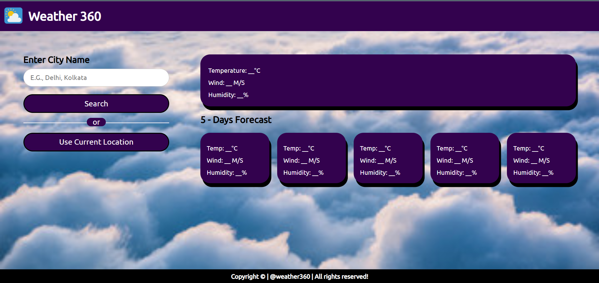

# 🌦️ Weather 360

Welcome to **Weather 360** — a beautiful, responsive weather web application that provides real-time weather information and a 5-day forecast based on city search or current location.

---

## 📸 Preview



---

## 🚀 Features

- 🔍 **Search** by city name
- 📍 **Use current location** with geolocation
- 🌡️ Real-time weather updates (temperature, wind, humidity)
- 📅 **5-Day Forecast** display
- 🖌️ Modern and clean user interface
- 📱 Fully responsive across devices
- 🌐 Live weather data using API integration

---

## 🛠️ Built With

- **Frontend**: HTML5, CSS3, JavaScript
- **API**: OpenWeatherMap API
- **Tools**: Geolocation API, Fetch API

---

## 📂 Project Structure

```
Weather-Web-Application/
├── index.html
├── style.css
├── script.js
├── weather.png (Screenshot Image)
└── README.md
```

---

## 🔑 Getting Started

Follow these steps to run the project locally:

1. **Clone the repository**
   ```bash
   git clone https://github.com/your-username/Weather-Web-Application.git
   ```

2. **Navigate to the project directory**
   ```bash
   cd Weather-Web-Application
   ```

3. **Open `index.html`** in your preferred browser.  
   You can also use a **Live Server** extension in VSCode for a better experience.

---

## ⚙️ Setup Weather API

1. Get a free API key from [OpenWeatherMap](https://openweathermap.org/api).
2. Open the `script.js` file.
3. Replace `"YOUR_API_KEY"` with your actual API key:

   ```javascript
   const apiKey = "YOUR_API_KEY";
   ```

---

## 💡 Future Enhancements

- 🌎 Auto language and units selection based on location
- 🌙 Dark Mode toggle
- 📍 Saving favorite cities
- 🎨 More animated icons and smooth transitions

---

## 🤝 Contributing

Contributions, issues, and feature requests are welcome!  
Feel free to fork the repository and submit a pull request.

---

## 📄 License

This project is licensed under the [MIT License](LICENSE).

---

## 📬 Contact

Made with ❤️ by **[Your Name]**  
[GitHub Profile](https://github.com/tanu91112) • [LinkedIn](www.linkedin.com/in/tanu-chandravanshi-338940251) • [Email](tanuchandravanshi9@gmail.com)

---

## 🌟 Support

If you like this project, please ⭐ star it on GitHub to support the project and encourage future improvements!

---

# Thank you for visiting Weather 360! 🌤️
